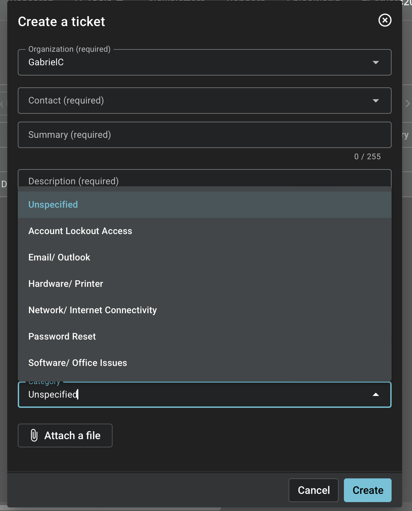
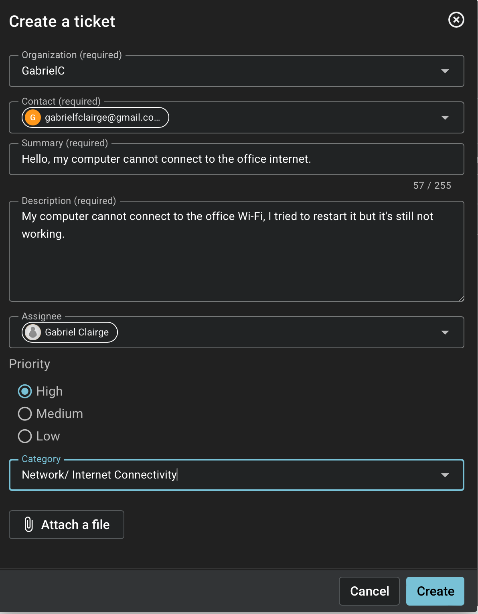
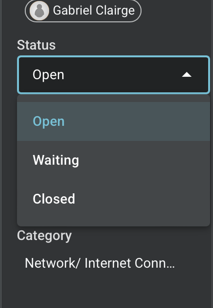
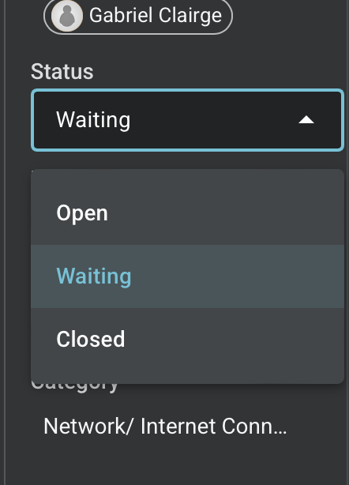
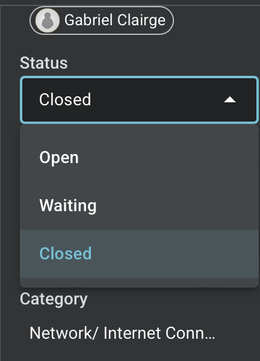

# Spiceworks Ticketing Lab – Documentation

## Project Overview
In this lab I practiced using Spiceworks Cloud Help Desk as a Tier 1 Help Desk technician.  
I created tickets, assigned statuses, worked with SLAs, escalated issues, and resolved support requests.

## Skills Demonstrated
- Creating and managing support tickets
- Setting and tracking ticket statuses (Open, In Progress, Resolved, Closed)
- Working with SLAs
- Escalating tickets
- Documenting resolutions
- Creating knowledge base articles

---

## Lab Steps

### 1. Setting Up Categories
I created the following ticket categories:
- Password Reset
- Software / Office Issues
- Hardware / Printer
- Network / Internet Connectivity
- Email / Outlook
- Account Lockout / Access

**Screenshot:**  
**

### 2. Creating Tickets
I created multiple simulated end-user tickets covering common help desk issues.

**Example Ticket:**
- **Subject:** User cannot connect to the internet
- **Category:** Network / Internet Connectivity
- **Priority:** High
- **Status:** Open → In Progress → Resolved

**Screenshot:**  
**

### 3. Changing Ticket Status
I practiced moving tickets through the normal help desk workflow:
1. Open
2. Waiting
3. Closed

**Screenshot:**  
1. **
2. **
3. **

### 4. Created rules based on ticket category.
I created rules and resolution times for different priorities.

**Screenshot:**  
**

### 5. Escalating a Ticket
I escalated a ticket that required higher-level support with detailed note.

**Screenshot:**  
**

### 6. Resolving Tickets
For each ticket I documented:
- Problem description
- Troubleshooting steps taken
- Root cause
- Resolution
- Verification

**Screenshot:**  
*(Add screenshot of a resolved ticket with notes)*

### 7. Knowledge Base Articles
I created short knowledge base articles for common issues so future tickets can be resolved faster.

**Screenshot:**  
*(Add screenshot of knowledge base articles)*

---

## Summary
This lab gave me hands-on experience with a real help desk ticketing system. I practiced the full ticket lifecycle that a Tier 1 technician uses every day: creating, triaging, updating, escalating, and resolving tickets while following proper documentation and SLA standards.
