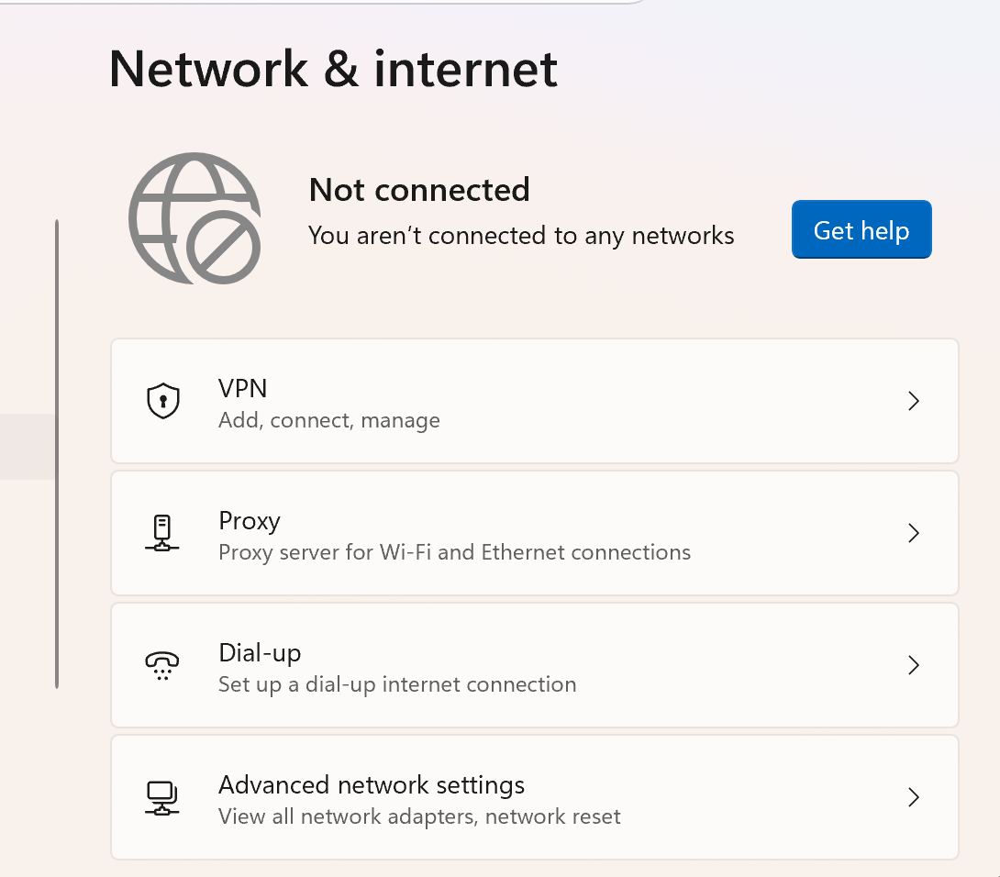
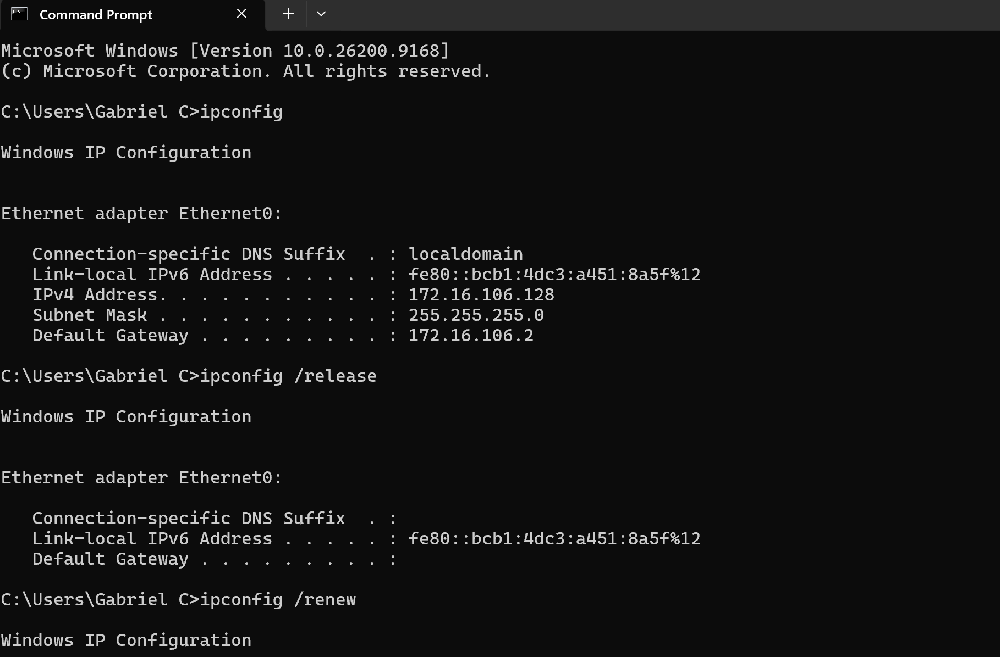
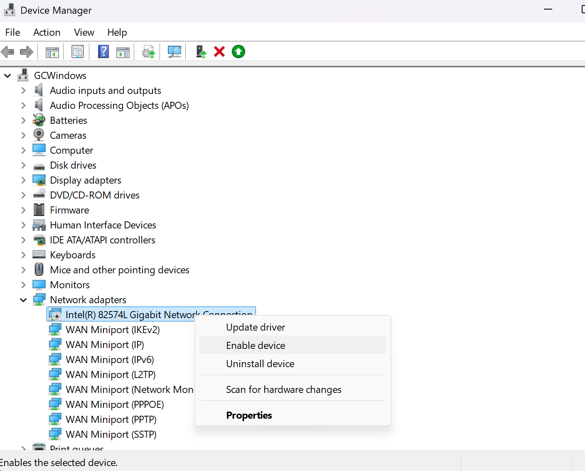
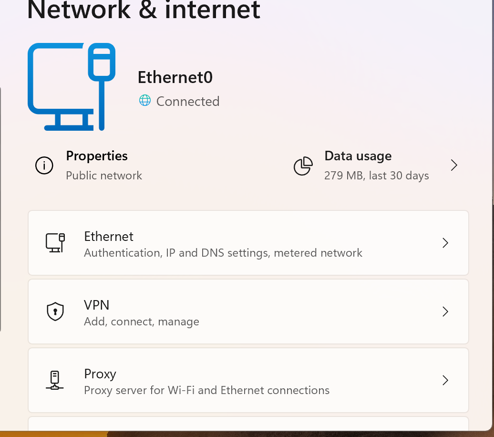

# Windows Troubleshooting Knowledge Base

## Project Overview
This lab documents hands-on troubleshooting of common Windows issues that a Help Desk technician faces daily.  
Each issue was intentionally broken in a Windows 11 virtual machine, then diagnosed and fixed using standard support methods.

---

## 1. Network Connectivity Issues

**Issue:** User cannot connect to the internet / No network access

**Symptoms:**
- No internet connection
- Network icon shows limited or no connectivity
- Websites do not load

**How the issue was created:**
- Disabled the network adapter
- Set an invalid static IP address

**Troubleshooting Steps:**
1. Checked network status in Settings → Network & Internet
2. Opened Command Prompt and ran `ipconfig` to verify IP address
3. Verified if the adapter was enabled
4. Ran `ipconfig /release` and `ipconfig /renew`
5. Flushed DNS with `ipconfig /flushdns`
6. Corrected IP configuration and re-enabled the network adapter

**Root Cause:**  
Network adapter was disabled / Invalid IP configuration

**Resolution:**  
Re-enabled the adapter and renewed the IP address

**Verification:**  
Successfully opened a website and confirmed a valid IP address

**Screenshot:**  
**

**

**

**

**

---

## 2. Printer Troubleshooting

**Issue:** Printer shows offline or print jobs are stuck

**Symptoms:**
- Printer status shows “Error” or “Offline”
- Print jobs remain in the queue and do not print

**How the issue was created:**
- Installed a virtual printer (Microsoft XPS Document Writer)
- Set the printer offline / left jobs stuck in the queue

**Troubleshooting Steps:**
1. Checked printer status in Settings → Bluetooth & devices → Printers & scanners
2. Opened the print queue
3. Stopped the Print Spooler service
4. Cleared files in `C:\Windows\System32\spool\PRINTERS`
5. Restarted the Print Spooler service
6. Tested printing again

**Root Cause:**  
Print Spooler service issue / Stuck print jobs

**Resolution:**  
Cleared the spooler folder and restarted the Print Spooler service

**Verification:**  
Print queue is empty and test page no longer shows error

**Screenshot:**  
*(Add screenshot here)*

---

## 3. Outlook / Email Issues

**Issue:** Email not working on the device

**Symptoms:**
- Cannot send or receive emails
- Outlook or email app not connecting

**How the issue was created:**
- Simulated outdated email app / profile issue

**Troubleshooting Steps:**
1. Asked for more details about the problem
2. Identified which email application was being used
3. Checked for app updates
4. Updated the application and restarted the device
5. Confirmed email was working again

**Root Cause:**  
Outdated email application

**Resolution:**  
Updated the email app and restarted the device

**Verification:**  
User can send and receive emails successfully

**Screenshot:**  
*(Add screenshot here)*

---

## 4. Slow Computer Performance

**Issue:** Computer is running very slow

**Symptoms:**
- Long boot time
- Applications open slowly
- High disk or CPU usage

**How the issue was created:**
- Filled disk space / opened many applications / simulated high resource usage

**Troubleshooting Steps:**
1. Opened Task Manager (Ctrl + Shift + Esc)
2. Checked CPU, Memory, and Disk usage
3. Identified processes using high resources
4. Closed unnecessary programs
5. Checked available disk space
6. Restarted the computer

**Root Cause:**  
High resource usage / Low disk space

**Resolution:**  
Closed resource-heavy programs and freed disk space

**Verification:**  
System performance returned to normal

**Screenshot:**  
*(Add screenshot here)*

---

## 5. Account and Login Problems

**Issue:** User cannot log in / Account locked or password issue

**Symptoms:**
- Login fails
- Account lockout message
- Password not accepted

**How the issue was created:**
- Locked a local user account or forced a password issue

**Troubleshooting Steps:**
1. Verified the username being used
2. Checked if the account was locked
3. Reset the local user password (if authorized)
4. Unlocked the account
5. Tested login with the new credentials

**Root Cause:**  
Account lockout / Incorrect password

**Resolution:**  
Reset password and unlocked the account

**Verification:**  
User successfully logged in

**Screenshot:**  
*(Add screenshot here)*

---

## Summary
These five labs cover the most common issues handled by Help Desk technicians: network problems, printer issues, email failures, slow performance, and account/login problems. Each issue was documented with symptoms, troubleshooting steps, root cause, and resolution.
